토건예산과 복지예산, 그리고 삶의 질(=자살율)
=======================================================

뉴스타파에서 한국 각 지자체 토건예산과 복지예산의 증감을 추적하여 삶의 질과 함께 공개한 자료. 
자료는 [여기](http://newstapa.com/news/201411935)에서 확인할 수 있다. 

우선 자료를 읽어보자. 연속형 자료로 사용하기 위해 원본 자료에서 "%"를 미리 삭제하고 읽었다. 


```r
# 자료읽기
setwd("~/SparkleShare/learnR/Rstar/myResearch/140604예산과자살률")
myData <- read.csv("data.tsv", header = T, sep = "\t")

# 자료 확인
head(myData)
```

```
##   순번 광역단체 기초단체 X2009년.토건예산 X2012년.토건예산 토건예산증감.p.
## 1    1     서울     본청            21.41            12.71           -8.70
## 2    2     서울   종로구            36.41            19.97          -16.44
## 3    3     서울     중구            33.54            18.50          -15.04
## 4    4     서울   용산구            34.44            15.04          -19.40
## 5    5     서울   성동구            27.87            19.95           -7.92
## 6    6     서울   광진구            26.49            11.83          -14.66
##   X2009년.복지예산 X2012년.복지예산 복지예산증감.p.
## 1             22.1             26.6             4.5
## 2             18.6             26.3             7.7
## 3             23.6             28.6             5.0
## 4             22.1             34.9            12.8
## 5             23.6             33.0             9.4
## 6             31.6             37.3             5.7
##   X2012년.10만명.당.자살자수.연령표준화.
## 1                                   21.2
## 2                                   14.2
## 3                                   25.3
## 4                                   23.0
## 5                                   23.1
## 6                                   16.0
```

```r
str(myData)
```

```
## 'data.frame':	242 obs. of  10 variables:
##  $ 순번                                  : int  1 2 3 4 5 6 7 8 9 10 ...
##  $ 광역단체                              : Factor w/ 16 levels "서울","부산",..: 1 1 1 1 1 1 1 1 1 1 ...
##  $ 기초단체                              : Factor w/ 204 levels "본청","북구",..: 1 10 3 27 28 7 197 9 32 33 ...
##  $ X2009년.토건예산                      : num  21.4 36.4 33.5 34.4 27.9 ...
##  $ X2012년.토건예산                      : num  12.7 20 18.5 15 19.9 ...
##  $ 토건예산증감.p.                       : num  -8.7 -16.44 -15.04 -19.4 -7.92 ...
##  $ X2009년.복지예산                      : num  22.1 18.6 23.6 22.1 23.6 31.6 29.1 39.7 33.7 40.7 ...
##  $ X2012년.복지예산                      : num  26.6 26.3 28.6 34.9 33 37.3 38.4 46.9 43.5 47.7 ...
##  $ 복지예산증감.p.                       : num  4.5 7.7 5 12.8 9.4 5.7 9.3 7.2 9.8 7 ...
##  $ X2012년.10만명.당.자살자수.연령표준화.: num  21.2 14.2 25.3 23 23.1 16 24.9 23.4 19.3 23 ...
```

```r
summary(myData)
```

```
##       순번          광역단체      기초단체   X2009년.토건예산
##  Min.   :  1.0   경기   : 32   본청   : 16   Min.   : 6.37   
##  1st Qu.: 61.2   서울   : 26   중구   :  6   1st Qu.:31.76   
##  Median :121.5   경북   : 24   동구   :  6   Median :45.80   
##  Mean   :121.5   전남   : 23   서구   :  5   Mean   :41.49   
##  3rd Qu.:181.8   강원   : 19   남구   :  5   3rd Qu.:52.55   
##  Max.   :242.0   경남   : 18   북구   :  4   Max.   :71.16   
##                  (Other):100   (Other):200                   
##  X2012년.토건예산 토건예산증감.p.  X2009년.복지예산 X2012년.복지예산
##  Min.   : 5.43    Min.   :-34.43   Min.   : 4.3     Min.   : 4.4    
##  1st Qu.:18.61    1st Qu.:-14.59   1st Qu.:13.7     1st Qu.:15.2    
##  Median :33.38    Median : -9.43   Median :18.1     Median :21.1    
##  Mean   :31.28    Mean   :-10.21   Mean   :22.8     Mean   :25.9    
##  3rd Qu.:43.01    3rd Qu.: -5.57   3rd Qu.:29.0     3rd Qu.:35.3    
##  Max.   :59.23    Max.   :  6.77   Max.   :57.2     Max.   :60.7    
##                                                                     
##  복지예산증감.p. X2012년.10만명.당.자살자수.연령표준화.
##  Min.   :-7.60   Min.   : 7.2                          
##  1st Qu.: 0.60   1st Qu.:22.5                          
##  Median : 2.10   Median :25.8                          
##  Mean   : 3.11   Mean   :27.6                          
##  3rd Qu.: 5.10   3rd Qu.:30.9                          
##  Max.   :14.90   Max.   :58.4                          
## 
```


편의를 위해 칼럼명을 바꾸었다. 

```r
names(myData)
```

```
##  [1] "순번"                                  
##  [2] "광역단체"                              
##  [3] "기초단체"                              
##  [4] "X2009년.토건예산"                      
##  [5] "X2012년.토건예산"                      
##  [6] "토건예산증감.p."                       
##  [7] "X2009년.복지예산"                      
##  [8] "X2012년.복지예산"                      
##  [9] "복지예산증감.p."                       
## [10] "X2012년.10만명.당.자살자수.연령표준화."
```

```r
names(myData) <- c("No", "loc1", "loc2", "CS2009", "CS2012", "fCS", "WF2009", 
    "WF2012", "fWF", "SR")
# CS : Construction 토건 WF : Welfare 복지 f : fluctuate 증감 SR : suicide
# rate 자살률
head(myData)
```

```
##   No loc1   loc2 CS2009 CS2012    fCS WF2009 WF2012  fWF   SR
## 1  1 서울   본청  21.41  12.71  -8.70   22.1   26.6  4.5 21.2
## 2  2 서울 종로구  36.41  19.97 -16.44   18.6   26.3  7.7 14.2
## 3  3 서울   중구  33.54  18.50 -15.04   23.6   28.6  5.0 25.3
## 4  4 서울 용산구  34.44  15.04 -19.40   22.1   34.9 12.8 23.0
## 5  5 서울 성동구  27.87  19.95  -7.92   23.6   33.0  9.4 23.1
## 6  6 서울 광진구  26.49  11.83 -14.66   31.6   37.3  5.7 16.0
```


우선 자살율과 다른 것들이 상관성이 있는지 부터 보자.

```r
plot(myData[, c(4:10)])
```

 


산점도 상으로 토건예산과 복지예산 사이에 음의 상관성이 있는 것으로 보인다. 하지만 자살율과의 관계는 모호하다. 


```r
attach(myData)
cor.test(CS2009, SR)
```

```
## 
## 	Pearson's product-moment correlation
## 
## data:  CS2009 and SR
## t = 4.118, df = 240, p-value = 5.26e-05
## alternative hypothesis: true correlation is not equal to 0
## 95 percent confidence interval:
##  0.1352 0.3710
## sample estimates:
##    cor 
## 0.2569
```

```r
cor.test(CS2012, SR)
```

```
## 
## 	Pearson's product-moment correlation
## 
## data:  CS2012 and SR
## t = 6.16, df = 240, p-value = 3.034e-09
## alternative hypothesis: true correlation is not equal to 0
## 95 percent confidence interval:
##  0.2553 0.4736
## sample estimates:
##    cor 
## 0.3695
```

```r
cor.test(fCS, SR)
```

```
## 
## 	Pearson's product-moment correlation
## 
## data:  fCS and SR
## t = 3.28, df = 240, p-value = 0.001193
## alternative hypothesis: true correlation is not equal to 0
## 95 percent confidence interval:
##  0.08318 0.32474
## sample estimates:
##    cor 
## 0.2071
```

```r

cor.test(WF2009, SR)
```

```
## 
## 	Pearson's product-moment correlation
## 
## data:  WF2009 and SR
## t = -4.241, df = 240, p-value = 3.174e-05
## alternative hypothesis: true correlation is not equal to 0
## 95 percent confidence interval:
##  -0.3776 -0.1427
## sample estimates:
##     cor 
## -0.2641
```

```r
cor.test(WF2012, SR)
```

```
## 
## 	Pearson's product-moment correlation
## 
## data:  WF2012 and SR
## t = -4.798, df = 240, p-value = 2.823e-06
## alternative hypothesis: true correlation is not equal to 0
## 95 percent confidence interval:
##  -0.4068 -0.1763
## sample estimates:
##     cor 
## -0.2958
```

```r
cor.test(fWF, SR)
```

```
## 
## 	Pearson's product-moment correlation
## 
## data:  fWF and SR
## t = -3.591, df = 240, p-value = 0.0004001
## alternative hypothesis: true correlation is not equal to 0
## 95 percent confidence interval:
##  -0.3421 -0.1026
## sample estimates:
##     cor 
## -0.2258
```


결과를 보면 모두 p.value가 0.05 이하로 상관성이 없다고 할 수 없겠다. 하지만 상관계수는 -0.3에서 0.4 사이로 비교적 낮다고 할 수 있다. 

그렇다면 토건예산과 복지예산 사이의 관계는 어떨까.


```r
cor.test(CS2009, WF2009)
```

```
## 
## 	Pearson's product-moment correlation
## 
## data:  CS2009 and WF2009
## t = -20.12, df = 240, p-value < 2.2e-16
## alternative hypothesis: true correlation is not equal to 0
## 95 percent confidence interval:
##  -0.8351 -0.7403
## sample estimates:
##     cor 
## -0.7924
```

```r
cor.test(CS2012, WF2012)
```

```
## 
## 	Pearson's product-moment correlation
## 
## data:  CS2012 and WF2012
## t = -21.52, df = 240, p-value < 2.2e-16
## alternative hypothesis: true correlation is not equal to 0
## 95 percent confidence interval:
##  -0.8506 -0.7636
## sample estimates:
##     cor 
## -0.8116
```

```r
cor.test(fCS, fWF)
```

```
## 
## 	Pearson's product-moment correlation
## 
## data:  fCS and fWF
## t = -10.86, df = 240, p-value < 2.2e-16
## alternative hypothesis: true correlation is not equal to 0
## 95 percent confidence interval:
##  -0.653 -0.483
## sample estimates:
##     cor 
## -0.5742
```

```r
detach(myData)
```


결과를 보면 p.value가 0.05 이하로 상관성이 없다고 할 수 없겠다. 2009년의 경우 상관계수는 -0.79, 2012년의 경우 -0.81로 토건예산과 복지예산 사이에는 음의 상관성이 비교적 강하게 작용함을 확인했다. 다만 증감의 경우 -0.57 정도로 상관성이 크다고는 할 수 없었다. 즉, 토건예산의 증감과 복지예산의 증감이 밀접하게 관련되어 있다고 보기는 어렵다. 

토건예산과 복지예산의 관계를 선형모델로 나타내 보자
2009년의 경우

```r
myData.lm2009 <- lm(myData$WF2009 ~ myData$CS2009)
summary(myData.lm2009)
```

```
## 
## Call:
## lm(formula = myData$WF2009 ~ myData$CS2009)
## 
## Residuals:
##     Min      1Q  Median      3Q     Max 
## -25.085  -3.741  -0.888   3.412  19.146 
## 
## Coefficients:
##               Estimate Std. Error t value Pr(>|t|)    
## (Intercept)    51.0103     1.4801    34.5   <2e-16 ***
## myData$CS2009  -0.6791     0.0337   -20.1   <2e-16 ***
## ---
## Signif. codes:  0 '***' 0.001 '**' 0.01 '*' 0.05 '.' 0.1 ' ' 1
## 
## Residual standard error: 7.46 on 240 degrees of freedom
## Multiple R-squared:  0.628,	Adjusted R-squared:  0.626 
## F-statistic:  405 on 1 and 240 DF,  p-value: <2e-16
```

```r
plot(myData.lm2009)
```

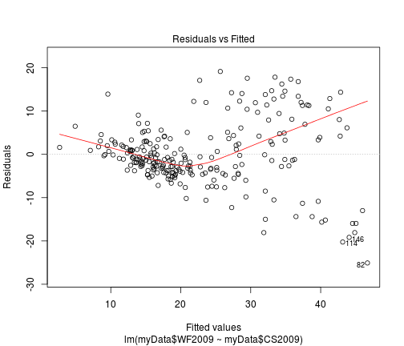  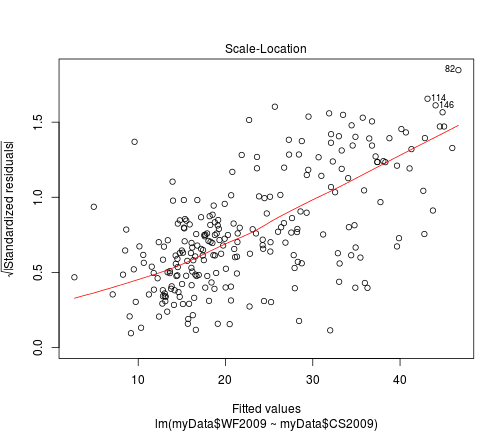 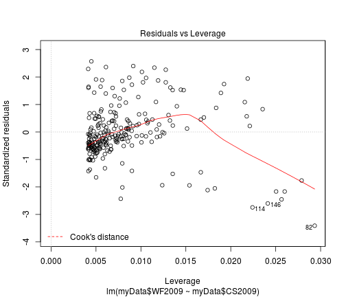 

```r
plot(myData$WF2009 ~ myData$CS2009)
abline(myData.lm2009)
```

 


2012년의 경우

```r
myData.lm2012 <- lm(myData$WF2012 ~ myData$CS2012)
summary(myData.lm2009)
```

```
## 
## Call:
## lm(formula = myData$WF2009 ~ myData$CS2009)
## 
## Residuals:
##     Min      1Q  Median      3Q     Max 
## -25.085  -3.741  -0.888   3.412  19.146 
## 
## Coefficients:
##               Estimate Std. Error t value Pr(>|t|)    
## (Intercept)    51.0103     1.4801    34.5   <2e-16 ***
## myData$CS2009  -0.6791     0.0337   -20.1   <2e-16 ***
## ---
## Signif. codes:  0 '***' 0.001 '**' 0.01 '*' 0.05 '.' 0.1 ' ' 1
## 
## Residual standard error: 7.46 on 240 degrees of freedom
## Multiple R-squared:  0.628,	Adjusted R-squared:  0.626 
## F-statistic:  405 on 1 and 240 DF,  p-value: <2e-16
```

```r
plot(myData.lm2012)
```

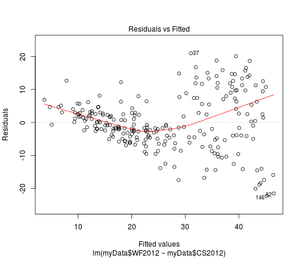  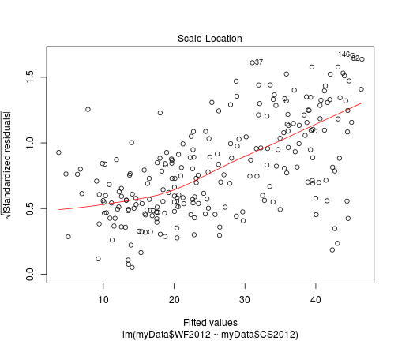 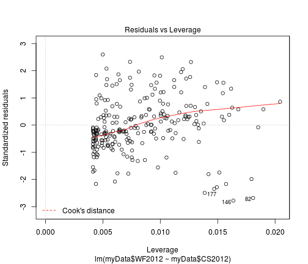 

```r
plot(myData$WF2012 ~ myData$CS2012)
abline(myData.lm2012)
```

 


뉴스타파에서 보도 했던 토건예산 증감률과 2012년 자살율, 복지예산 증감률과 2012년 자살률을 선형모델로 나타내 보자.
우선 토건예산 증감률과 2012년 자살률을 보자.

```r
myData.lmfCS <- lm(myData$SR ~ myData$fCS)
summary(myData.lmfCS)
```

```
## 
## Call:
## lm(formula = myData$SR ~ myData$fCS)
## 
## Residuals:
##    Min     1Q Median     3Q    Max 
## -18.13  -4.97  -1.45   3.39  28.76 
## 
## Coefficients:
##             Estimate Std. Error t value Pr(>|t|)    
## (Intercept)  29.7891     0.8259   36.07   <2e-16 ***
## myData$fCS    0.2142     0.0653    3.28   0.0012 ** 
## ---
## Signif. codes:  0 '***' 0.001 '**' 0.01 '*' 0.05 '.' 0.1 ' ' 1
## 
## Residual standard error: 7.58 on 240 degrees of freedom
## Multiple R-squared:  0.0429,	Adjusted R-squared:  0.0389 
## F-statistic: 10.8 on 1 and 240 DF,  p-value: 0.00119
```

```r
plot(myData.lmfCS)
```

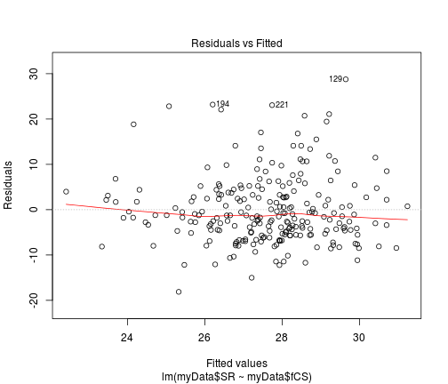 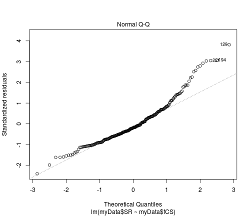 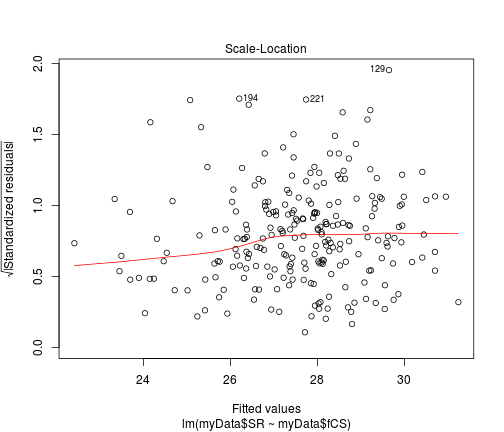 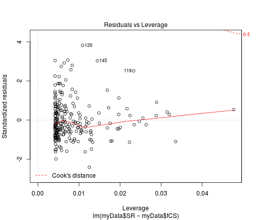 

```r
plot(myData$SR ~ myData$fCS)
abline(myData.lmfCS)
```

 


다음으로 복지예산 증감률과 2012년 자살률을 보자. 

```r
myData.lmfWF <- lm(myData$SR ~ myData$fWF)
summary(myData.lmfWF)
```

```
## 
## Call:
## lm(formula = myData$SR ~ myData$fWF)
## 
## Residuals:
##    Min     1Q Median     3Q    Max 
## -21.14  -4.93  -1.24   3.45  29.56 
## 
## Coefficients:
##             Estimate Std. Error t value Pr(>|t|)    
## (Intercept)   29.023      0.626   46.36   <2e-16 ***
## myData$fWF    -0.456      0.127   -3.59    4e-04 ***
## ---
## Signif. codes:  0 '***' 0.001 '**' 0.01 '*' 0.05 '.' 0.1 ' ' 1
## 
## Residual standard error: 7.55 on 240 degrees of freedom
## Multiple R-squared:  0.051,	Adjusted R-squared:  0.047 
## F-statistic: 12.9 on 1 and 240 DF,  p-value: 4e-04
```

```r
plot(myData.lmfWF)
```

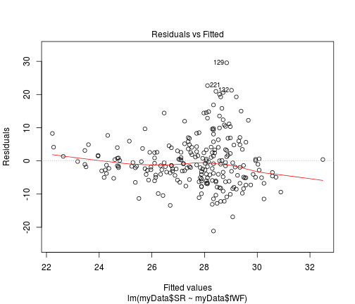  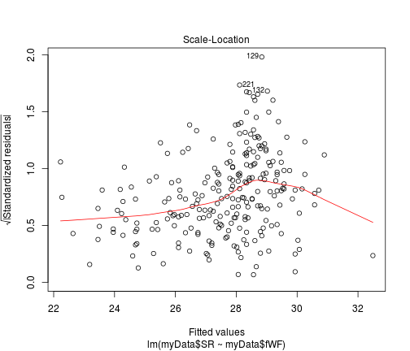 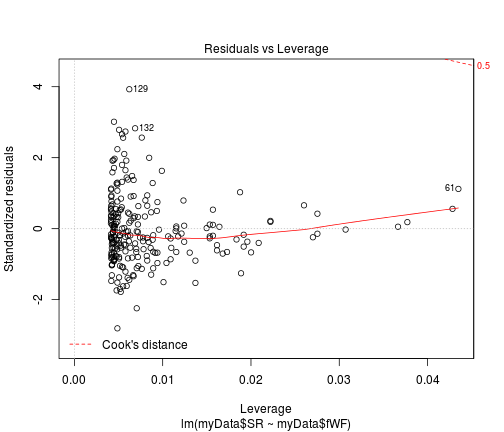 

```r
plot(myData$SR ~ myData$fWF)
abline(myData.lmfWF)
```

 


그럼 다중회귀분석을 해 보자.

```r
myData.mlm <- lm(SR ~ ., data = myData[c(4:10)])
summary(myData.mlm)
```

```
## 
## Call:
## lm(formula = SR ~ ., data = myData[c(4:10)])
## 
## Residuals:
##     Min      1Q  Median      3Q     Max 
## -19.521  -4.198  -0.055   3.615  24.254 
## 
## Coefficients: (2 not defined because of singularities)
##             Estimate Std. Error t value Pr(>|t|)    
## (Intercept)  24.4542     3.5383    6.91  4.4e-11 ***
## CS2009       -0.1648     0.0825   -2.00  0.04679 *  
## CS2012        0.3356     0.0882    3.81  0.00018 ***
## fCS               NA         NA      NA       NA    
## WF2009       -0.1186     0.1837   -0.65  0.51906    
## WF2012        0.0846     0.1678    0.50  0.61453    
## fWF               NA         NA      NA       NA    
## ---
## Signif. codes:  0 '***' 0.001 '**' 0.01 '*' 0.05 '.' 0.1 ' ' 1
## 
## Residual standard error: 7.18 on 237 degrees of freedom
## Multiple R-squared:  0.153,	Adjusted R-squared:  0.139 
## F-statistic: 10.7 on 4 and 237 DF,  p-value: 5.58e-08
```


후진선택법을 이용해 보자.

```r
myData.reduced <- step(myData.mlm, direction = "backward")
```

```
## Start:  AIC=958.8
## SR ~ CS2009 + CS2012 + fCS + WF2009 + WF2012 + fWF
## 
## 
## Step:  AIC=958.8
## SR ~ CS2009 + CS2012 + fCS + WF2009 + WF2012
## 
## 
## Step:  AIC=958.8
## SR ~ CS2009 + CS2012 + WF2009 + WF2012
## 
##          Df Sum of Sq   RSS AIC
## - WF2012  1        13 12220 957
## - WF2009  1        21 12228 957
## <none>                12207 959
## - CS2009  1       206 12413 961
## - CS2012  1       746 12953 971
## 
## Step:  AIC=957.1
## SR ~ CS2009 + CS2012 + WF2009
## 
##          Df Sum of Sq   RSS AIC
## - WF2009  1        13 12233 955
## <none>                12220 957
## - CS2009  1       213 12433 959
## - CS2012  1      1096 13316 976
## 
## Step:  AIC=955.4
## SR ~ CS2009 + CS2012
## 
##          Df Sum of Sq   RSS AIC
## <none>                12233 955
## - CS2009  1       209 12441 957
## - CS2012  1      1225 13458 976
```

```r
summary(myData.reduced)
```

```
## 
## Call:
## lm(formula = SR ~ CS2009 + CS2012, data = myData[c(4:10)])
## 
## Residuals:
##     Min      1Q  Median      3Q     Max 
## -19.804  -4.335  -0.204   3.585  24.376 
## 
## Coefficients:
##             Estimate Std. Error t value Pr(>|t|)    
## (Intercept)  23.0939     1.4423   16.01  < 2e-16 ***
## CS2009       -0.1283     0.0636   -2.02    0.045 *  
## CS2012        0.3143     0.0642    4.89  1.8e-06 ***
## ---
## Signif. codes:  0 '***' 0.001 '**' 0.01 '*' 0.05 '.' 0.1 ' ' 1
## 
## Residual standard error: 7.15 on 239 degrees of freedom
## Multiple R-squared:  0.151,	Adjusted R-squared:  0.144 
## F-statistic: 21.3 on 2 and 239 DF,  p-value: 3.19e-09
```


회귀계수의 신뢰구간

```r
confint(myData.reduced)
```

```
##               2.5 %    97.5 %
## (Intercept) 20.2527 25.935178
## CS2009      -0.2536 -0.003112
## CS2012       0.1878  0.440901
```


회귀잔차 그래프

```r
plot(myData.reduced, which = 1)
```

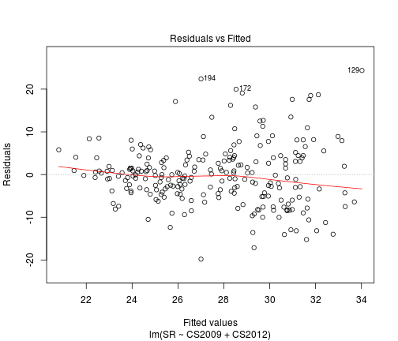 

