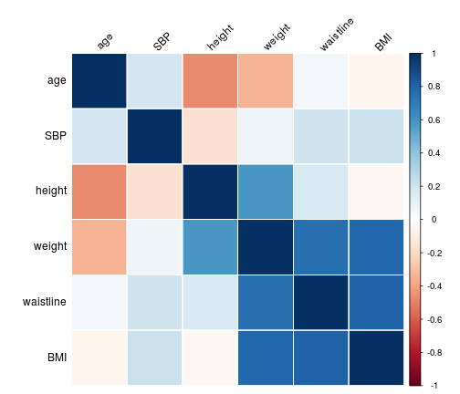
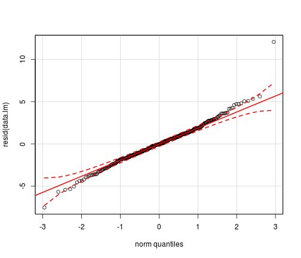
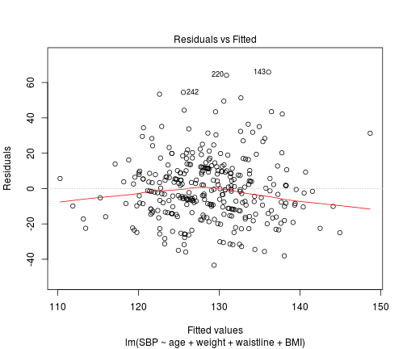

상관분석 (and 편상관분석)
=======================================================

의미 : 선형적 상관관계의 정도를 보는 것

### 실습1 : 모수적 상관분석

1) 허리둘레와 BMI의 산점도를 그린다.


```r
setwd("~/SparkleShare/learnR/Rstar/보건의학통계/lesson06")
data <- read.csv("6_correlation_and_regression.csv", header = T)
head(data)
```

```
##   age height weight waistline  BMI SBP
## 1  57    164   62.0        85 23.1 147
## 2  25    172   54.0        65 18.3 116
## 3  57    157   59.0        83 23.9 122
## 4  43    170   87.8       104 30.4 130
## 5  52    155   50.0        83 20.8 120
## 6  27    163   76.0        83 28.6 128
```


```r
# plot
plot(data)
```

 

```r
plot(BMI ~ waistline, data = data)
abline(lm(BMI ~ waistline, data = data))
```

 

```r

# corrplot
data.cor <- cor(data)
library(corrplot)
corrplot(data.cor, method = "shade", shade.col = NA, tl.col = "black", tl.srt = 45, 
    order = "hclust")
```

 


2) 허리둘레와 BMI의 상관관계를 분석한다. 


```r
data.cor["waistline", "BMI"]
```

```
## [1] 0.8007
```

```r
cor.test(data$waistline, data$BMI)
```

```
## 
## 	Pearson's product-moment correlation
## 
## data:  data$waistline and data$BMI
## t = 23.91, df = 320, p-value < 2.2e-16
## alternative hypothesis: true correlation is not equal to 0
## 95 percent confidence interval:
##  0.7577 0.8367
## sample estimates:
##    cor 
## 0.8007
```


3) 체중의 영향을 고려하여 허리둘레와 BMI의 편상관계수를 구한다. 


```r
# install.packages('ppcor')
library("ppcor")
pcor.test(data$waistline, data$BMI, data$weight)
```

```
##   estimate   p.value statistic   n gp  Method
## 1   0.5152 6.776e-27     10.74 322  1 pearson
```


### 실습2 : 비모수 상관분석

```r
data2 <- read.csv("6_spearman.csv", header = T)
head(data2)
```

```
##   Age SBP
## 1  15 116
## 2  15 130
## 3  25 120
## 4  30 132
## 5  40 160
## 6  50 148
```

```r

cor.test(data2$Age, data2$SBP, method = "spearman")
```

```
## Warning: Cannot compute exact p-value with ties
```

```
## 
## 	Spearman's rank correlation rho
## 
## data:  data2$Age and data2$SBP
## S = 5.577, p-value = 0.03606
## alternative hypothesis: true rho is not equal to 0
## sample estimates:
##    rho 
## 0.8407
```

```r
cor.test(data2$Age, data2$SBP, method = "kendall")
```

```
## Warning: Cannot compute exact p-value with ties
```

```
## 
## 	Kendall's rank correlation tau
## 
## data:  data2$Age and data2$SBP
## z = 1.913, p-value = 0.05578
## alternative hypothesis: true tau is not equal to 0
## sample estimates:
##    tau 
## 0.6901
```


### 실습3 : 단순회귀분석


```r
data.lm <- lm(data$BMI ~ data$waistline)
summary(data.lm)
```

```
## 
## Call:
## lm(formula = data$BMI ~ data$waistline)
## 
## Residuals:
##    Min     1Q Median     3Q    Max 
## -7.520 -1.309 -0.044  1.253 12.068 
## 
## Coefficients:
##                Estimate Std. Error t value Pr(>|t|)    
## (Intercept)     -3.9761     1.2548   -3.17   0.0017 ** 
## data$waistline   0.3313     0.0139   23.91   <2e-16 ***
## ---
## Signif. codes:  0 '***' 0.001 '**' 0.01 '*' 0.05 '.' 0.1 ' ' 1
## 
## Residual standard error: 2.19 on 320 degrees of freedom
## Multiple R-squared:  0.641,	Adjusted R-squared:  0.64 
## F-statistic:  572 on 1 and 320 DF,  p-value: <2e-16
```


Call : 회귀분석에 사용된 모델 식

Residuals: 잔차, 즉 회귀선의 값과 실제 관측 값의 차이를 각 분위수로 표시

Coefficients: 절편, 독립변수 등에 대한 회귀계수를 표시

Residual standard error: 잔차의 표준오차와 자유도

Multiple R-squared: 결정계수, 즉 추정된 회귀선이 실제 관측값을 얼마나 잘 설명하는 가를 나타냄. 0에서 1사이의 값을 가지며 1은 실제관측 값들이 회귀선 상에 위치함을 의미.

Adjusted R-squared: 수정결정계수, 주로 다중회귀분석에서 독립변수를 증가시키면 결정계수가 올라가는 것에 대한 대안으로 사용.

F-statistic: F통계량은 해당 모형이 의미가 있는지 아닌지를 알려줌. 계수 중 하나라도 0이 아닌 것이 있다면 그 모형은 유의미하다고 판단.

선형관계 확인

```r
plot(data$BMI ~ data$waistline)
abline(data.lm)
```

 


잔차의 정규성증명

```r
hist(resid(data.lm))
```

 


```r
library(car)
qq.plot(resid(data.lm))
```

```
## Warning: 'qq.plot' is deprecated.
## Use 'qqPlot' instead.
## See help("Deprecated") and help("car-deprecated").
```

 


reference
[[1]](http://analyticsstory.com/98)
[[2]](http://starmethod.tistory.com/95)

### 실습4 : 다중회귀분석


```r
data.mlm <- lm(SBP ~ ., data = data)
summary(data.mlm)
```

```
## 
## Call:
## lm(formula = SBP ~ ., data = data)
## 
## Residuals:
##    Min     1Q Median     3Q    Max 
## -43.45 -11.63  -1.08   9.64  64.92 
## 
## Coefficients:
##             Estimate Std. Error t value Pr(>|t|)  
## (Intercept)  -19.360    141.974   -0.14    0.892  
## age            0.190      0.105    1.81    0.072 .
## height         0.591      0.862    0.69    0.493  
## weight        -1.024      1.014   -1.01    0.313  
## waistline      0.323      0.221    1.46    0.144  
## BMI            3.225      2.718    1.19    0.236  
## ---
## Signif. codes:  0 '***' 0.001 '**' 0.01 '*' 0.05 '.' 0.1 ' ' 1
## 
## Residual standard error: 18.1 on 316 degrees of freedom
## Multiple R-squared:  0.0967,	Adjusted R-squared:  0.0824 
## F-statistic: 6.77 on 5 and 316 DF,  p-value: 5.19e-06
```


후진선택법

```r
data.reduced <- step(data.mlm, direction = "backward")
```

```
## Start:  AIC=1870
## SBP ~ age + height + weight + waistline + BMI
## 
##             Df Sum of Sq    RSS  AIC
## - height     1       154 103267 1868
## - weight     1       333 103446 1869
## - BMI        1       459 103573 1869
## <none>                   103113 1870
## - waistline  1       700 103813 1870
## - age        1      1066 104179 1871
## 
## Step:  AIC=1868
## SBP ~ age + weight + waistline + BMI
## 
##             Df Sum of Sq    RSS  AIC
## <none>                   103267 1868
## - waistline  1       673 103940 1868
## - age        1      1064 104330 1869
## - weight     1      1254 104520 1870
## - BMI        1      2310 105577 1873
```

```r
summary(data.reduced)
```

```
## 
## Call:
## lm(formula = SBP ~ age + weight + waistline + BMI, data = data)
## 
## Residuals:
##    Min     1Q Median     3Q    Max 
## -43.37 -11.60  -1.21   9.97  65.88 
## 
## Coefficients:
##             Estimate Std. Error t value Pr(>|t|)    
## (Intercept)   77.724     11.123    6.99  1.7e-11 ***
## age            0.190      0.105    1.81   0.0717 .  
## weight        -0.339      0.173   -1.96   0.0507 .  
## waistline      0.317      0.220    1.44   0.1515    
## BMI            1.396      0.524    2.66   0.0081 ** 
## ---
## Signif. codes:  0 '***' 0.001 '**' 0.01 '*' 0.05 '.' 0.1 ' ' 1
## 
## Residual standard error: 18 on 317 degrees of freedom
## Multiple R-squared:  0.0954,	Adjusted R-squared:  0.084 
## F-statistic: 8.36 on 4 and 317 DF,  p-value: 2.03e-06
```


회귀계수의 신뢰구간

```r
confint(data.reduced)
```

```
##                2.5 %   97.5 %
## (Intercept) 55.83879 99.60890
## age         -0.01685  0.39623
## weight      -0.67846  0.00101
## waistline   -0.11667  0.74978
## BMI          0.36452  2.42698
```


회귀잔차 그래프

```r
plot(data.reduced, which = 1)
```

 


reference
[[1]](http://ultradorosy.blog.me/50166610239)
[[2]](http://dogmas.tistory.com/entry/%EB%8B%A4%EC%A4%91%ED%9A%8C%EA%B7%80%EB%B6%84%EC%84%9D-multiple-regression-analysis-%ED%86%B5%EA%B3%84-R-%EC%B4%88%EA%B8%89-12)


